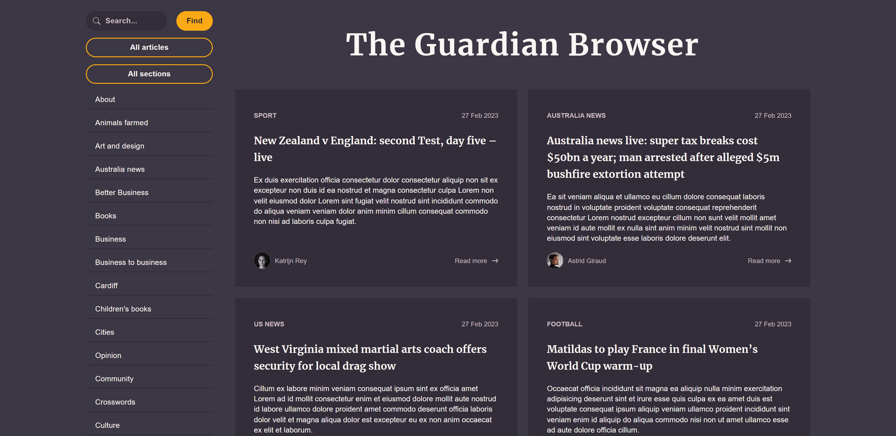
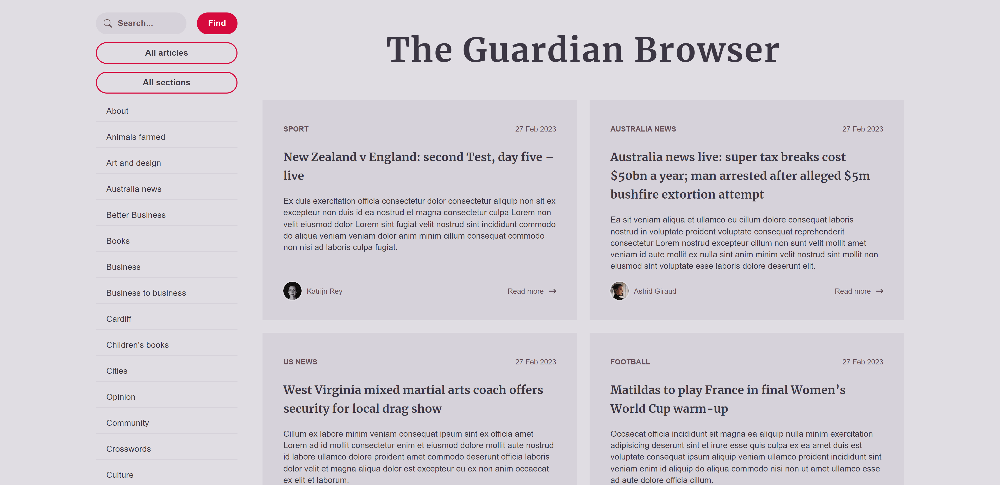
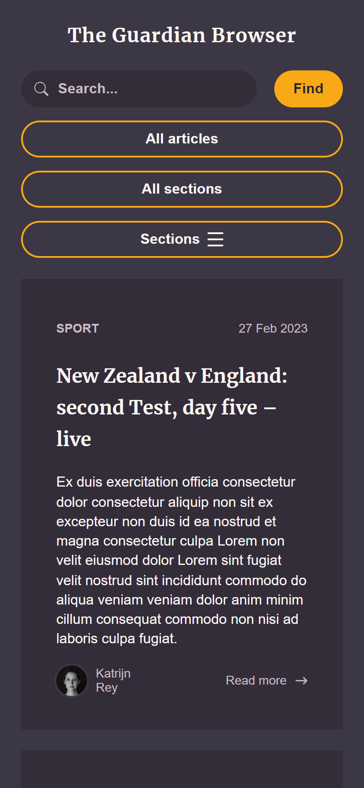
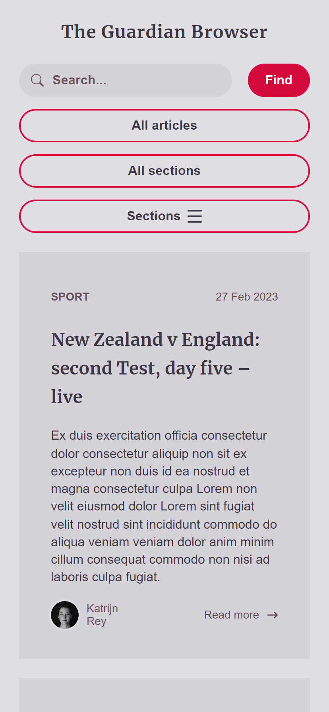

# The Guardian Browser

The purpose of this App is to fetch articles from The Guardian Open Platform API [https://open-platform.theguardian.com/](https://open-platform.theguardian.com/).

## Requirements

1. Results must be narrowed down to selected category (section) and / or the search phrase entered by the user

2. Results must be paginated - with the maximum of 10 articles per page

3. Articles presentation can be of any form - but single article must contain date, title and its category (section)

4. App UI must consist of 2 parts:

- Sidebar, with:
  - Search field
  - Submit button
  - "All articles" (resets category and search phrase constraint)
  - "All sections" (resets category constraint, leaves the search phrase constraint)
  - Available categories (sections) (on Desktop)
  - Available categories (sections) and "Sections" button (on Mobile)
- Search results

5. On mobile - available categories (sections) should be displayed as a toggleable dropdown with the "Sections" button

6. On desktop - available categories (sections) should be displayed in sidebar on the left side of the page, together with search field

7. The most critical App features should be covered by tests.

8. This project should be made without use of UI libraries.

## Used Libraries:

- axios
- jest
- lorem-ipsum
- react
- react-router
- react-testing-library
- sass
- typescript

## Disclaimer

A `createHashRouter` was used instead of `createBrowserRouter` due to the known issue with GitHub Pages, as described in the Create React App [Documentation](https://create-react-app.dev/docs/deployment/#notes-on-client-side-routing):
>"GitHub Pages doesn’t support routers that use the HTML5 pushState history API under the hood (for example, React Router using `browserHistory`). This is because when there is a fresh page load for a url like `http://user.github.io/todomvc/todos/42`, where `/todos/42` is a frontend route, the GitHub Pages server returns 404 because it knows nothing of `/todos/42`."

This App is using public API key published in The Guardian Open Platform [Documentation](https://open-platform.theguardian.com/documentation/).

The private API key can be obtained through The Guardian Open Platform [Access](https://open-platform.theguardian.com/access/) website.

## Final Result

